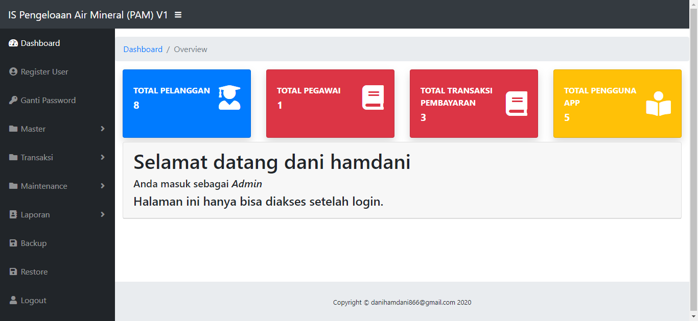
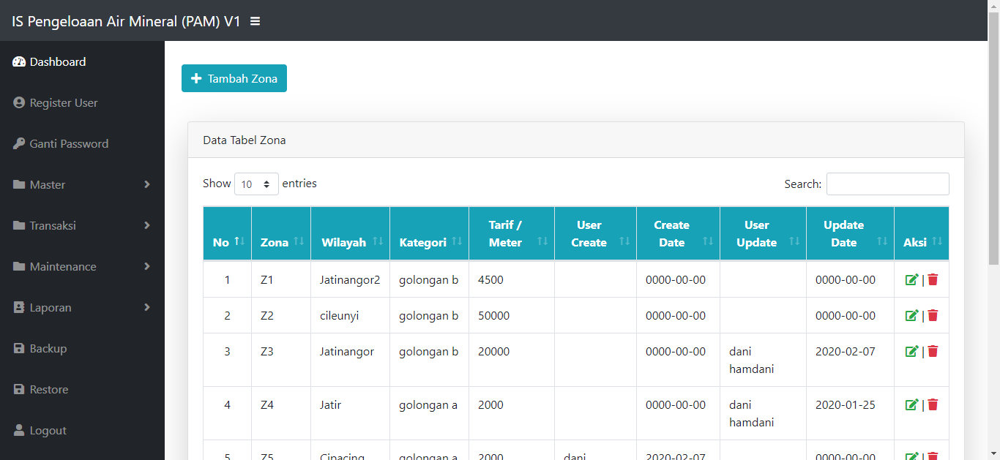

# Aplikasi Pam Air

## Deskripsi
This program was created to deal with the problems in recording that occur in the office of the water company, where there are often errors in recording and also the duration of making reports if using a manual or using Microsoft Excel. Then this program is made with features:
 1. Entry data.
 2. Delete data.
 3. Edit data.
 4. Make Report pdf.
 5. Export to mysql. 
 6. Import database from sql or excel.

## How To Run
 1. Download this repo or clone this repo using `git clone https://github.com/lovanto/pos_pam.git`
 2. Move this repo to your localhost dir(xampp, appserv, etc.)
 3. Import file **pam_v1.sql** to your phpmyadmin
 4. And then open it on browser [click here](http://localhost/pos_pam) if still default setting

## Notes
Gunakan program ini sebagai referensi bukan untuk plagiarisme.